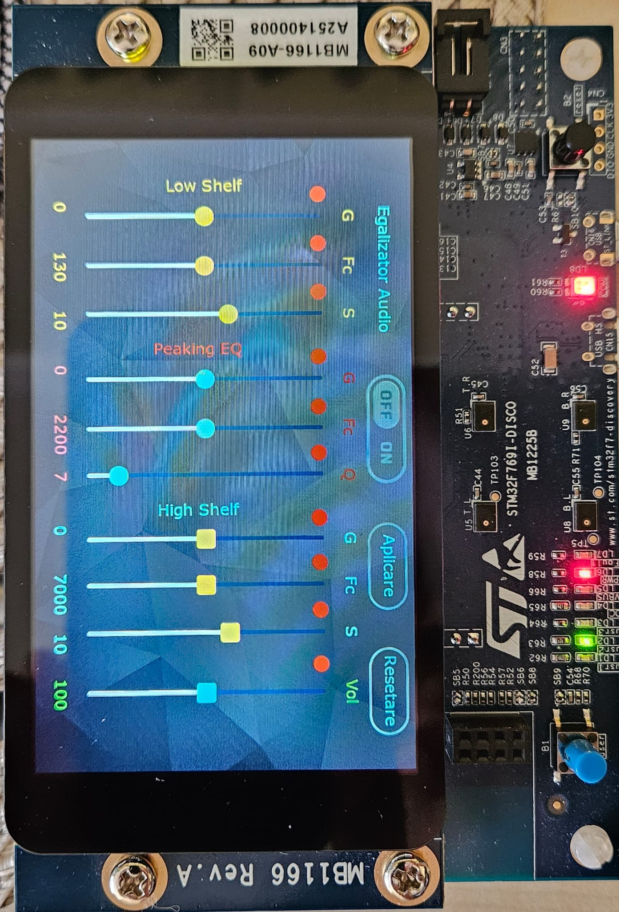

# STM32F769I_DISCO TBS

The default IDE is set to STM32CubeIDE, to change IDE open the STM32F769I_DISCO.ioc with STM32CubeMX and select from the supported IDEs (EWARM, MDK-ARM, and STM32CubeIDE). Supports flashing of the STM32F769I_DISCO board directly from TouchGFX Designer using GCC and STM32CubeProgrammer.Flashing the board requires STM32CubeProgrammer which can be downloaded from the ST webpage.

This TBS is configured for 480 x 800 pixels 16bpp screen resolution.

Performance testing can be done using the GPIO pins designated with the following signals:
- VSYNC_FREQ  - Pin PC6(D1)
- RENDER_TIME - Pin PC7(D0)
- FRAME_RATE  - Pin PJ1(D2)
- MCU_ACTIVE  - Pin PF6(D3)

This is a Graphical real-time audio equalizer using the STM32F769I_DISCO board.
The driver for the audio codec is custom made, inspired from the provided one in the BSP board package.
I heavly encourage to check the driver (WM8994) from the BSP package and also read the datasheet for the chip - i know is long but it's worth it.
There are some register writes that are needed and are not included in the WM8994 datacheet but are in the BSP driver ("ERATA" register writes - fixes for a potentian bug). 
Further implementations are due be done.

The MCU gets data from the audio codec via I2S/SAI (done by DMA) and processes the samples using an RBJ argorithm. The it sends the data back to the code (also done via DMA).

RO: Egalizator audio in timp real. Ne folosim de display-ul cu care vine placa pentru a modifica parametrii DSP-ului responsabil de egalizare.

